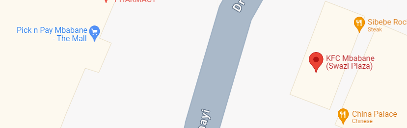

# Private Investigator Writeup - Tryhackme

### Introduction

In this [room](https://tryhackme.com/r/room/privateinvestigator), we aim to uncover details about a target's recent travel preparations and journey by analyzing a series of images uploaded on X (formerly Twitter). By employing OSINT (Open Source Intelligence) techniques such as reverse image search and analyzing visual clues, we can piece together information about the locations involved in the target's travel. The key questions we seek to answer are:

1. What is the name of the grocery store or mall the target visited for stocking up before traveling?
2. What is the IATA code of the airport from which the target departed?
3. What is the name of the city to which the target arrived?

### Analysis

### Grocery Store or Mall Visited

The first image shows a location near a KFC restaurant. By performing a reverse image search, we identified the KFC location as being in Mbabane, Eswatini. Using Google Maps, we confirmed that there is a mall in close proximity to this KFC. The name of this mall is **Pick n Pay Mbabane - The Mall**, which answers our first question.

 

### Airport of Departure

The second image provides clues about the airport from which the target departed. By conducting a reverse image search, we identified the airport as **King Mswati III International Airport** in Eswatini. A quick Google search for its IATA code reveals that it is **SHO**.

### City of Arrival

The third image contains partial information about the airline the target used. Through further investigation, we identified the airline as **Eswatini Air**. By examining the route map of Eswatini Air, we can determine the possible destinations. Given the clue that the answer should be six letters long, we narrow it down to **Harare**.

### Conclusion

Through careful analysis and the use of OSINT techniques, we successfully identified key details of the target's travel. This investigation showcases the power of open-source tools and techniques in gathering and analyzing information from publicly available sources.
